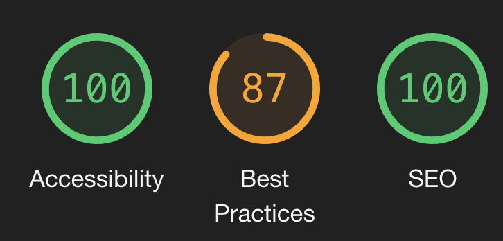
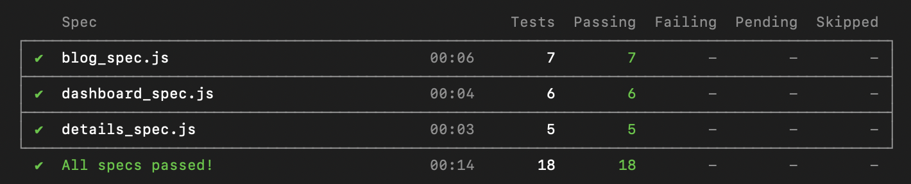

# My Blog 

## Table of Contents
* [Description](#description)
* [Installation](#installation)
* [Cypress Testing](#cypress)
* [Contributor](#contributor) 

## Description
 - This blog application was built in about a day and a half with Next.js and utilizes two dynamic routes, the ability to toggle between light and dark mode and includes end-to-end testing. Users have the ability to read blog posts about Next.js and to learn a little more about my family! 
 - [Click here](https://nextjs-blog-roan-seven.vercel.app/) to deploy the application
 

### Lighthouse audit:

## Installation
1. Clone down this [repo](https://github.com/Gifty-capstone/gifty-frontend)
2. `cd` into project directory
3. Run `npm i` to install all project dependencies
4. Run `npm run dev` to begin the server
5. Application should open in default browser window (if not, navigate to http://localhost:3000)

## Cypress Testing 
- Run and view all tests in terminal with `npx cypress run`
- Open Cypress window with `npx cypress open`

## Contributors
<table>
    <tr>
        <td><a href="https://github.com/daomeow">Melanie Daoheuang</td>
    </tr>
    <tr>
      <td></td>
</table>

